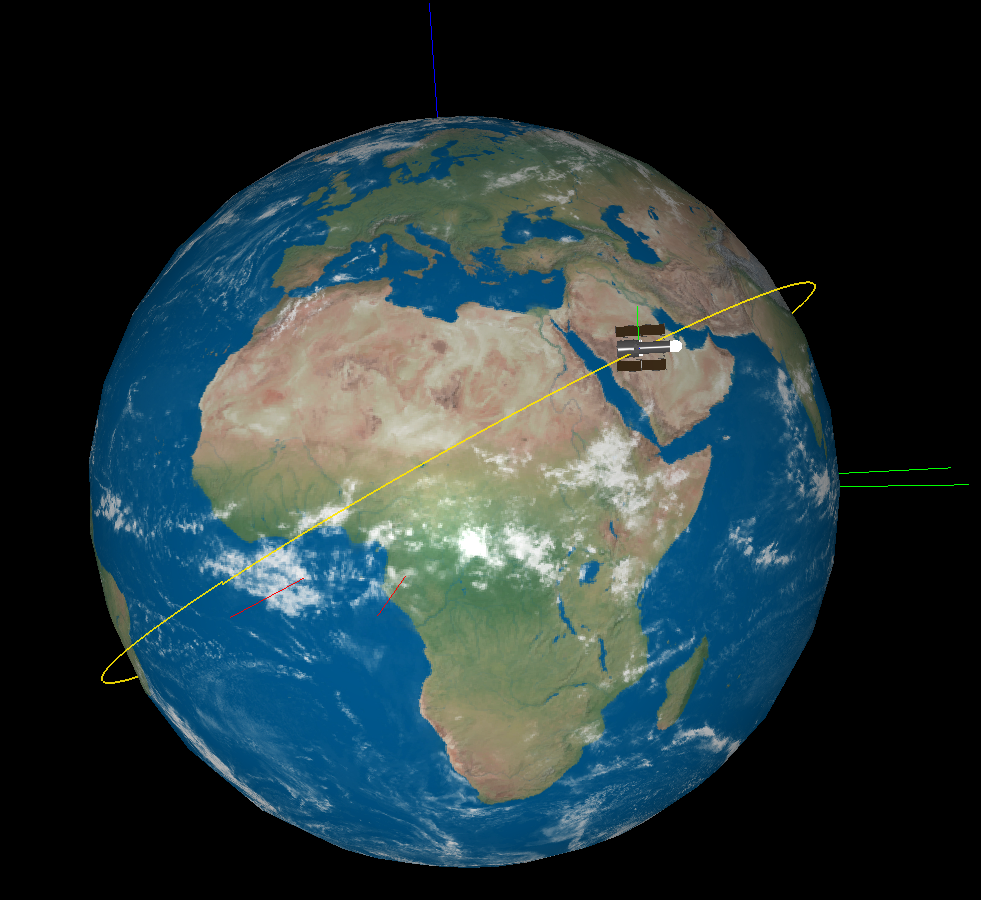

# Spacecraft Dynamics Sandbox (Python)

> Modular Python framework for orbital propagation and spacecraft attitude control, originally built around a Hubble Space Telescope simulation study and extended into a configurable sandbox for further experimentation.

<p align="center">
  
  <br>
  <em>3D visualization of the Hubble Space Telescope in low Earth orbit, with body frame and Keplerian reference orbit rendered in vispy.</em>
</p>

---

## Overview

This codebase combines an orbital propagator, a spacecraft model with realistic sensor and actuator dynamics, and a set of attitude controllers into a single simulator. The original use case was a quantitative study of HST inertial pointing under realistic disturbances, sensor noise, and actuator saturation; the architecture was then generalized into a **custom sandbox mode** that lets you toggle propagators, sensors, perturbations, and controllers individually, so the same codebase can be reused for further spacecraft-dynamics studies.

The project was developed as the final project for **STE-3605 Mathematical Modeling and Simulation** at UiT — The Arctic University of Norway, and was then extended independently to add the modular sandbox mode beyond what the coursework required.

📄 **Full technical report:** [`docs/hst_simulation_study.pdf`](documents/HST_Simulation_Study.pdf)

---

## Capabilities

**Orbital dynamics**
- Two-body Keplerian propagator (closed-form)
- PKepler propagator with secular $J_2$ effects on $\Omega$, $\omega$, and mean-motion drift from TLE coefficients $\dot n$ and $\ddot n$
- Multi-year decay studies, including comparison against SGP4
- Frame conversions: ECI ↔ ECEF (with sidereal rotation), body, LVLH orbit frame, and RSW/Gaussian frame
- TLE-based initialization

**Attitude dynamics**
- Full 6-DOF rigid-body dynamics with quaternion kinematics (scalar-first convention, RK4 integration)
- HST inertia tensor with off-diagonal coupling
- Disturbance torques: gravity gradient + prescribed solar-array (thermal-snap) disturbance
- Actuator model: reaction wheels with per-axis saturation at $\pm 1.13$ Nm

**Sensors**
- 3-axis rate gyroscope (white noise $\sigma_g^2 = 10^{-6}$, zero bias)
- Star tracker(s), configurable count, with axis–angle noise model ($\sigma^2 = 10^{-2}$)
- Sun sensors (multiple, distributed in the body frame)
- Magnetometer (dipole Earth field model)

**Attitude determination**
- Single star-tracker passthrough
- TRIAD algorithm (two-vector deterministic)
- Davenport's $q$-method (multi-vector least-squares via the K-matrix dominant eigenvector)
- Multi-star-tracker fusion via Davenport

**Control**
- Feedback-linearized **PD** baseline controller, $\tau_c = \omega \times J\omega + J u$ with $u_{\text{PD}} = -k_1 q_v - k_2 \omega_{\text{err}}$
- Feedback-linearized **Sliding-Mode Controller** with boundary-layer smoothing on $s = \omega_{\text{err}} + 2k_1 q_v$

**Visualization & analysis**
- 3D real-time visualization (vispy): Earth with sidereal rotation, spacecraft body frame, orbit-frame triad, optional Keplerian-orbit reference line
- Ground-track plotting
- Pointing-error and orbital-element time histories

---

## Selected Results

The full results, plots, and discussion are in the [technical report](documents/HST_Simulation_Study.pdf). Some highlights:

**Long-term orbital decay (Part 1).** PKepler propagated from the HST TLE epoch over 9 years gives a roughly linear decay from $474.52$ km to $427.68$ km — adequate for short horizons but unable to reproduce NASA's mid-2030s reentry prediction because atmospheric drag enters only as a frozen $\dot n$, not as a real physical force. Propagating an older TLE forward by 8.65 years against a newer one shows that the shape parameters $(a, e, i)$ remain close, while $\Omega$ and $\omega$ diverge by $+187.59°$ and $+280.07°$ respectively — pure phase error from accumulated $J_2$-induced precession.

**Attitude control (Part 2).** With HST starting from a $\approx 120°$ misalignment and required to hold an inertial attitude over 4 orbital periods under gravity-gradient + solar-array disturbances:

| Configuration | True pointing error (avg, final orbit) |
|---|---:|
| Feedback-linearized PD, 1 star tracker | $\approx 4.61°$ ($1.66 \times 10^4$ arcsec) |
| Tuned SMC, 1 star tracker | $\approx 2.97°$ ($1.07 \times 10^4$ arcsec) |
| Tuned SMC, 3 star trackers + Davenport | $\approx 2.90°$ ($1.04 \times 10^4$ arcsec) |

The SMC consistently halves the RMS pointing error of the baseline PD. Going from 1 to 3 star trackers reduces the **measured** error by the expected $\sqrt{3}$ noise-reduction factor ($\approx 23\%$), but the **true** pointing error barely moves — HST's very large inertia ($J \sim 10^5\,\mathrm{kg\,m^2}$) acts as a low-pass filter on the high-frequency measurement noise, so improving the estimator alone is not enough. The true pointing accuracy is set by disturbances + actuator bandwidth, not by the star tracker.

This matches the engineering reality on the real HST: multiple star trackers are flown primarily for redundancy and sky coverage; sub-arcsecond pointing depends on the Fine Guidance Sensors and Kalman-style filtering, neither of which are modelled here.

---

## Scenarios

The main entry point is `main.py`. Available presets:

| Preset | Description |
|--------|-------------|
| `p1t1` | Orbital parameters at HST TLE epoch (sanity check of frames, anomalies, $q_{io}$) |
| `p1t2` | PKepler 9-year decay study + older-TLE-vs-newer-TLE propagation error |
| `p2t1` | Inertial-pointing comparison: feedback-linearized PD vs. tuned SMC, single star tracker |
| `p2t2` | Inertial-pointing with 3 star trackers + Davenport averaging, SMC |
| `custom` | Full sandbox — choose propagator, sensors, controllers, disturbances, ICs, etc. |

---

## Quick Start

```bash
git clone https://github.com/rodrig0conti/spacecraft-dynamics-sandbox.git
cd spacecraft-dynamics-sandbox
pip install -r requirements.txt
python main.py
```

By default `main.py` runs the preset configured at the top of the file. Edit the preset variable (or pass it via CLI if you wire up `argparse`) to switch between scenarios. For example:

```python
# main.py
PRESET = "p2t2"      # one of: p1t1, p1t2, p2t1, p2t2, custom
VISUALISE = True     # set False for headless mode (matplotlib only)
N_ORBITS = 4
```

For systems without OpenGL / vispy support, set `VISUALISE = False` and the run produces matplotlib plots only.

### Custom mode

The custom preset exposes the full toggles of the underlying libraries: propagator (`kepler` / `pkepler`), sensor suite (`gyro`, `star_tracker` × N, `sun_sensors`, `magnetometer`), attitude-determination method (`triad`, `davenport`, `passthrough`), disturbance set (`grav_grad`, `solar_array`), controller (`pd`, `smc`), and initial conditions (specify either Keplerian elements or state vector). The hooks for atmospheric drag, $J_2$ disturbance torque, and impulsive transfer maneuvers are documented in `main.py` but not yet implemented.

---

## Architecture

```
orbit_lib.py    Orbital propagators (Kepler, PKepler), frame conversions, TLE parsing
sat_lib.py     Sensor models, actuator model, attitude estimators, controllers
simutils.py    Quaternion math, rotations, numerical helpers
plotter.py     Headless plotting utilities (matplotlib)
simulator.py   3D real-time visualization framework (vispy) — see credit header inside
main.py        Scenario definitions, presets, custom-mode dispatcher
```

The scenario file ties everything together: it constructs the spacecraft state, registers sensors and controllers, advances the simulation step by step, and either runs headless (producing plots via `plotter.py`) or hands the state stream to `simulator.py` for 3D animation.

---

## Tech Stack

- **Python 3.10+**
- `numpy`, `scipy` — numerical core
- `matplotlib` — headless plotting
- `vispy` — 3D real-time visualization
- `sgp4` — reference propagator for long-term comparison

See [`requirements.txt`](requirements.txt) for exact versions.

---

## Limitations & Roadmap

**Current limitations**
- Atmospheric drag not modelled as a force (decay enters only through the TLE's frozen $\dot n$)
- $J_2$ enters as analytic secular drift in PKepler only; no $J_2$ torque on attitude
- No third-body, SRP, or higher-order gravity terms
- Reaction wheels treated as unity-gain torque actuators with hard saturation; no momentum-dumping logic
- No transfer-maneuver capability yet (impulsive $\Delta v$ or finite-burn)

**Planned extensions**
- Atmospheric drag (NRLMSISE-00 or Jacchia–Bowman with $F_{10.7}$ / $K_p$ inputs)
- $J_2$ disturbance torque on attitude
- Impulsive and finite-burn transfer maneuvers
- SGP4 native integration as an alternative orbit propagator
- Integration with the [Orbital Mechanics MATLAB Toolbox](https://github.com/rodrig0conti/Orbital-Mechanics-Toolbox) for transfer optimization

---

## Credits

- `simulator.py` was provided as course material at UiT (3D visualization framework). All credit for that file goes to the course instructor; it is included here with attribution. See the header inside the file.
- All other modules in this repository are my own implementation, building on the course assignments for STE-3605.
- HST inertia tensor, controller gain definitions, and disturbance models follow the course assignment specifications and standard references on spacecraft attitude dynamics (Sidi, *Spacecraft Dynamics and Control*; Markley & Crassidis, *Fundamentals of Spacecraft Attitude Determination and Control*; Vallado, *Fundamentals of Astrodynamics and Applications*).
- Hubble deorbit timeline reference: NASA Astrophysics Division (M. Clampin) public statements on HST orbital sufficiency through the mid-2030s.

The technical report includes a detailed disclosure of the development process and tooling used.

---

## Related Work

- [Orbital Mechanics Toolbox (MATLAB)](https://github.com/rodrig0conti/Orbital-Mechanics-Toolbox) — final bachelor project on orbital transfer optimization and Δv minimization. This Python sandbox extends and reimplements parts of that work with an object-oriented architecture and realistic spacecraft dynamics.
- [Aerospace Nozzles](https://github.com/rodrig0conti/Aerospace_Nozzles) — aerothermodynamic analysis of rocket nozzles.

---

## Author

**Rodrigo Conti Gallenti**
MSc Aerospace Engineering
